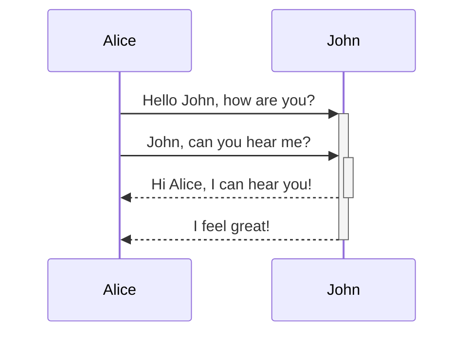

> [!NOTE] Note
> 这里是 Obsidian 的使用语法示例。

# 一级标题

## 二级标题


<br />

## 列表

- 无序列表
	- **加粗**
		- *斜体* 
			-  ==高亮==

1. 有序列表
	1. `行内代码块`
	2. [外部链接](https://github.com/Benn314)
	3. [[index | 双链]]

- [ ] Todo
- [x] Done ✅ 2024-09-23

<br />

## 数学公式块

行内数学公式：$lim_{x \to 0}\frac{sinx}{x}$

$$
f(x) = \int_{-\infty}^\infty
    f\hat(\xi),e^{2 \pi i \xi x}
    \,d\xi
$$


<br />

## 注释

这里是行内注释：%%预览模式下你将看不到这句话%% 

这里是跨行注释： 
%% 
所谓跨行 
就是可以有很多行 
%%

<br />

## 引用

> 路漫漫其修远兮，吾将上下而求索。——《离骚》

<br />

## 代码块

```c++
#include <iostrean>
using namespace std;

int main(){
	cout<<"Hello World!"<<endl;
	return 0;
}
```

### 图表



<br />

## 表格

|     | 标题 1 | 标题 2 |
| --- | ---- | ---- |
| 内容  | Xxx  |      |
| 1   |      |      |
| 2   |      |      |
| 3   |      |      |

<br />

## 脚注

H 脚注的用法很简单，只需要在段落中需要插入脚注的地方标注一个符号，再在段落后对这个符号进行解释即可。比如这是一个简单的脚注[^1]，这是一个长一些的脚注。[^长脚注]

[^1]: 很有用！ 
[^长脚注]: 这是一个可以写长段落或者代码的地方。 
			你可以使用缩进在脚注中纳入其他段落。 
			`{ 代码 }` 
			这样你就可以在脚注中添加任意数量的段落了。

<br />

## 嵌入图片

> 缺点是无法通过 html&css 标签居中，但可以通过 Obsidian 插件 `Mousewheel Image zoom` 调节图片大小

![[avatar1.jpg|325]]

<br />

## Callout 块

> 关键词大小写都可以

> [!info] Info
> Contents

> [!NOTE] Note
> Contents

> [!abstract] Abstract
> Contents

> [!Todo] Todo
> Contents

> [!tip] Tip
> Contents

> [!success] Success
> Contents

> [!Question] Question
> Contents

> [!Waring] Waring
> Contents

> [!Failure] Failure
> Contents

> [!Danger] Danger
> Contents

> [!Bug] Bug
> Contents

> [!Example] Example
> Contents

> [!Question] Can callouts be _nested_?
> > [!Todo] Yes!, they can. And collapsed!
> > > [!Example]
> > > You can even use multiple layers of nesting.

> [!Quote] Quote
> Contents

> [!Cite] Cite
> Contents
